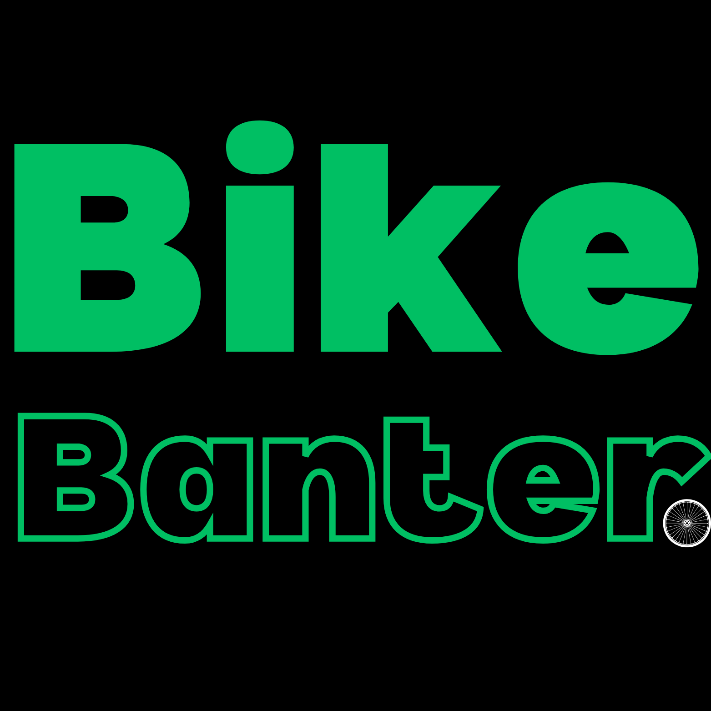

<h2>Optimise your cycle tour!</h2>

  
Table of Contents

  <ol>
    <li>
      <a href="#about-the-project">About The Project</a>
      <ul>
        <li>
            <a href="#design">Design</a>
            <ul>
                <li>
                    <a href="#home-page">Home Page</a>
                </li>
            </ul>
            <ul>
                <li>
                    <a href="#connect-page">Connect Page</a>
                </li>
            </ul>
            <ul>
                <li>
                    <a href="#gear-page">Gear Page</a>
                </li>
            </ul>
            <ul>
                <li>
                    <a href="#account-page">Account Page</a>
                </li>
            </ul>
            <ul>
                <li>
                    <a href="#settings-page">Settings Page</a>
                </li>
            </ul>
            <ul>
                <li>
                    <a href="#about-page">About Page</a>
                </li>
            </ul>
        </li>
      </ul>
      <ul>
        <li><a href="#built-with">Built With</a></li>
      </ul>
    </li>
    <li><a href="#usage">Usage</a></li>
  </ol>

<!-- ABOUT THE PROJECT -->
## About The Project

I am an avid cyclist. Sounds like yourself? This is a statement that comes with its own responsibilities. Cycling has numerous benefits for our mental health and longevity, and regular riding requires a careful dedication that can put strain on our day to day lives. 

As a bike to work commuter, I needed to carefully plan my route and what I needed to pack for my long journey. This can be of varying importance. 

Picture this:
* You forget to pack your chargers? 
* Maybe some construction is on that you haven't considered? 
* The roads are too icy for your tires? 
* Or worse yet, you forget your change of clothes for those intense days on the road? 

***Day ruined.***

That's where **BikeBanter** comes in, you can easily stay organised and connect with like minded people on your journeys! Customise your gear, add your items checklist, visualise your weather, route and suggestions from other cyclists, and see an overview of hazards you haven't considered. 

(<a href="#readme-top">back to top</a>)

### Design

Before getting to work on the website I created wireframes to visualise my creation. i wanted to create a minimalistic design which employees a trendy, user friendly design. It's important to make it easy on the eyes too with colour as many people would be looking at this website before they set out on their journey the next day.

### Home Page

### Connect Page

### Gear Page

### Account Page

### Settings Page

### About Page

(<a href="#readme-top">back to top</a>)

### Built With