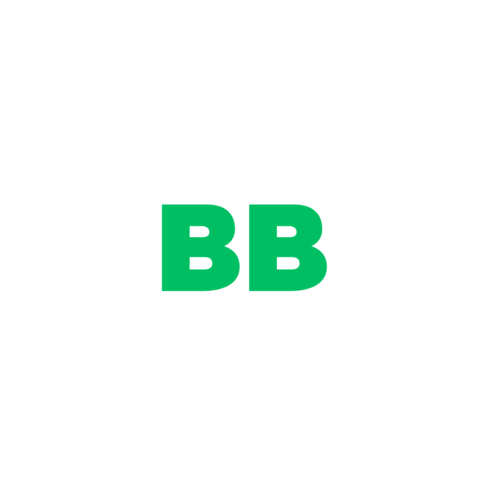
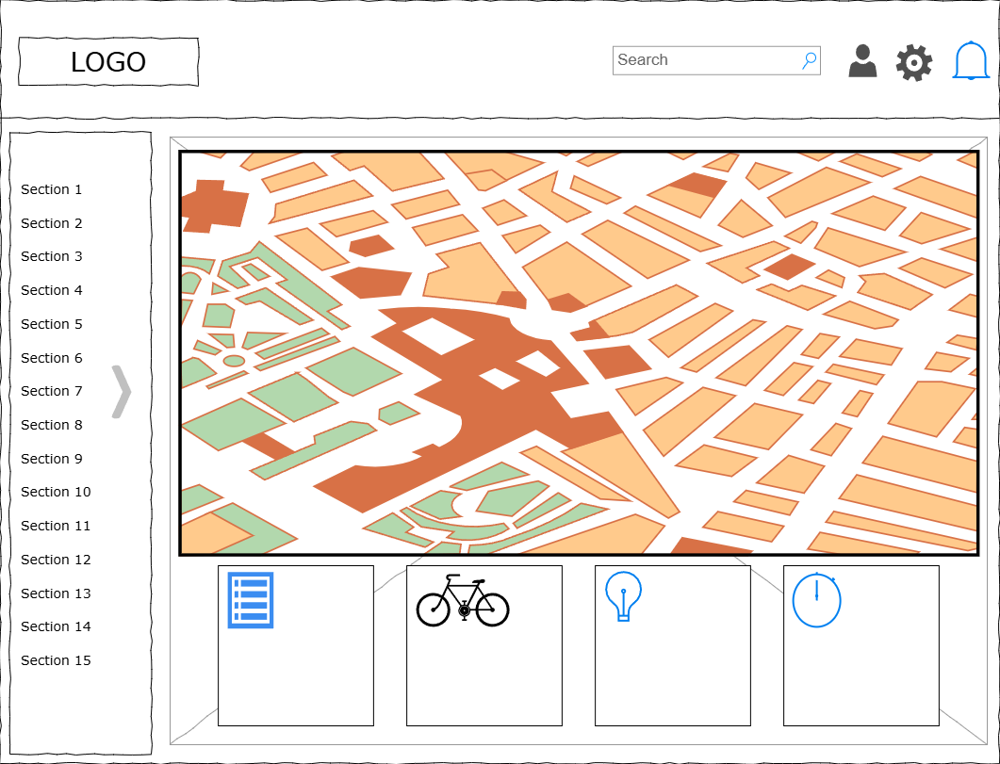
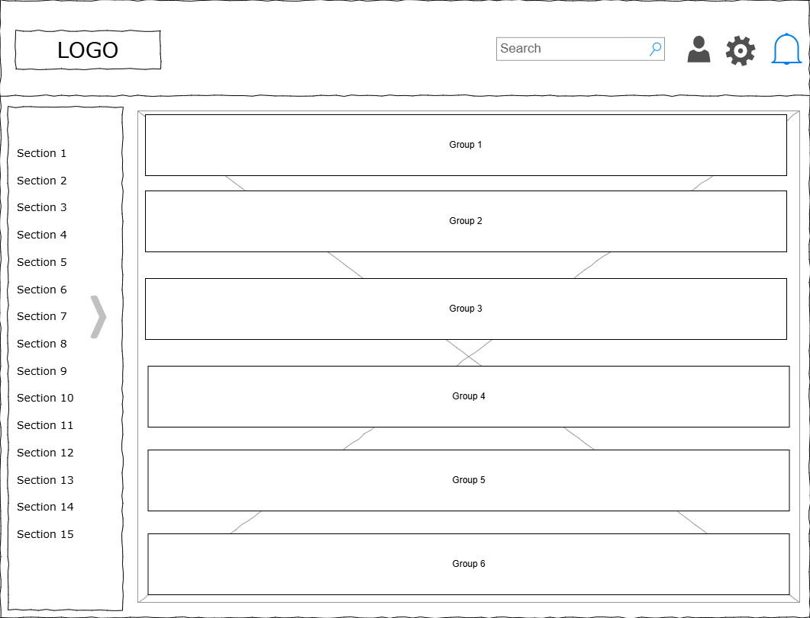
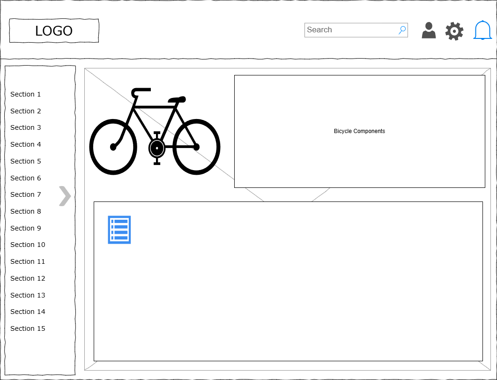
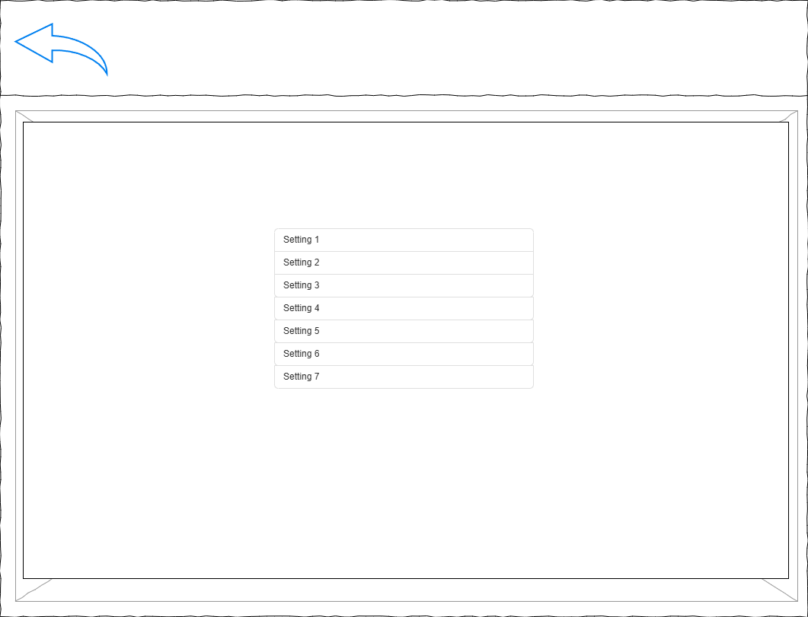
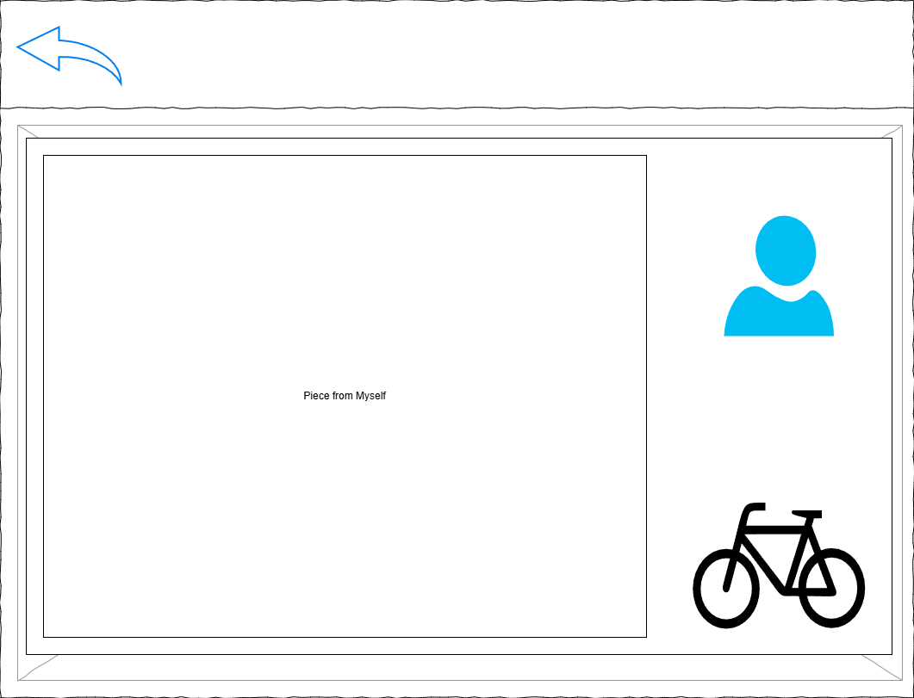

<h2>Optimise your cycle tour!</h2>

  
Table of Contents

  <ol>
    <li>
      <a href="#about-the-project">About The Project</a>
      <ul>
        <li>
            <a href="#design">Design</a>
            <ul>
                <li>
                    <a href="#home-page">Home Page</a>
                </li>
            </ul>
            <ul>
                <li>
                    <a href="#connect-page">Connect Page</a>
                </li>
            </ul>
            <ul>
                <li>
                    <a href="#gear-page">Gear Page</a>
                </li>
            </ul>
            <ul>
                <li>
                    <a href="#account-page">Account Page</a>
                </li>
            </ul>
            <ul>
                <li>
                    <a href="#settings-page">Settings Page</a>
                </li>
            </ul>
            <ul>
                <li>
                    <a href="#about-page">About Page</a>
                </li>
            </ul>
        </li>
      </ul>
      <ul>
        <li><a href="#built-with">Built With</a>
        <ul>
            <li>
                <a href="#application-programming-interfaces">Application Programming Interfaces</a>
            </li>
        </ul>
        <ul>
            <li>
                <a href="#database">Database</a>
            </li>
        </li>
        </ul>
        <ul>
            <li>
                <a href="#testing">Testing</a>
            </li>
        </li>
        </ul>
        <ul>
            <li>
                <a href="#aesthetics">Aesthetics</a>
            </li>
        </li>
        </ul>
      </ul>
    </li>
    <li><a href="#usage">Usage</a></li>
  </ol>

<!-- ABOUT THE PROJECT -->
## About The Project

I am an avid cyclist. Sounds like yourself? This is a statement that comes with its own responsibilities. Cycling has numerous benefits for our mental health and longevity, and regular riding requires a careful dedication that can put strain on our day to day lives. 

As a bike to work commuter, I needed to carefully plan my route and what I needed to pack for my long journey. This can be of varying importance. 

*Picture this:*
* You forget to pack your chargers? 
* Maybe some construction is on that you haven't considered? 
* The roads are too icy for your tires? 
* Or worse yet, you forget your change of clothes for those intense days on the road? 

***Day ruined.***

That's where **BikeBanter** comes in, you can easily stay organised and connect with like minded people on your journeys! Customise your gear, add your items checklist, visualise your weather, route and suggestions from other cyclists, and see an overview of hazards you haven't considered. 

(<a href="#readme-top">back to top</a>)

### Design

The design of the project did have a vision that changed a lot. I felt that the front end needed to *feel* modern and fluid. The design in the wireframes simply did not as much as anticipated. Thankfully I started this project with a goal to use everything that I could within libraries available to me, allowing me to seamlessly stay up to date with modern trends. 

(<a href="#readme-top">back to top</a>)

#### Aesthetics

Wireframes were especially useful for the foundations of the pages. As the project progressed I had learned how to utilize libraries such as shadcn, radix, and lucide. This saved a lot of work time, enabling me to focus on the functionality. 

I was able to have a modern design that I could easily update when needed. Handling the moving parts in the sidebar for example would have been a big headache as it grew in complexity. I did not need something revolutionary, I needed reliability.  

(<a href="#readme-top">back to top</a>)

#### Architecture

React was a completely new library to me and Next.js was a new framework. Therefore, I wanted to know how I could organise the project with the usual conventions, aiding me in composition of future projects. Atomic design methodology by front end engineer, Brad Frost, interested me enough to utilise it in file structure of BikeBanter. This approach to designing the project was not only efficient in thinking of various components which make up the project, but also made the coding far more manageable and fun. 

(<a href="#readme-top">back to top</a>)

#### Wireframes

Before getting to work on the website I created wireframes to visualise my creation. i wanted to create a minimalistic design which employees a trendy, user friendly design. It's important to make it easy on the eyes too with colour as many people would be looking at this website before they set out on their journey the next day.

(<a href="#readme-top">back to top</a>)

##### Home Page

(<a href="#readme-top">back to top</a>)

#### Connect Page

(<a href="#readme-top">back to top</a>)

#### Gear Page

(<a href="#readme-top">back to top</a>)

#### Account Page

(<a href="#readme-top">back to top</a>)

#### Settings Page

(<a href="#readme-top">back to top</a>)

#### About Page

(<a href="#readme-top">back to top</a>)

### Built With

In the initial setup of my project I used various technologies which aided in development. Typescript and CSS are my main coding languages to develop Bike Banter. They are complemented by the React library, built in the Next.js framework. Images were created in Canva and mockups were done in Draw.io.

(<a href="#readme-top">back to top</a>)

#### Application Programming Interfaces

For the 'Journey Map' I had a number of maps and APIs to use. This is where I had some big considerations because of the nature of the project. Here are a few of the available options:

* GoogleMapsAPI
* OpenStreetMap
* Mapbox and a Traffic Plugin

I needed to have up to date maps, features which show elevation, real time traffic, and hazards such as road closures. To some extend, I can tell the user to pay for premium to access a wider range of features, because it costs me money to utilize these features in my website. I needed to have advertisements for free users to cover the costs of the core features users, which also cost money to run. 

That left me with the decision, who do I go with? Well, GoogleMapsAPI was the best I think due to the up to date maps, elevation, and road closures. Even if it is the most expensive. OpenStreetMap uses old maps. Not remotely usable. Mapbox uses OpenStreetMap for its primary map too, so that's not an option.

These figures could be hard to handle so implementation of affiliated links and sponsored bike shops would be great. I think if this project reaches an international following thinking of the said monetary avenues would be necessary.

(<a href="#readme-top">back to top</a>)

#### Database

Security is arguably the most important aspect of an entire coding project. The last thing that I would want is to have user data exposed. I needed to create a database which was robust, excellent security features, and easy to work with for the scale of my project. 

I have designed a couple of projects with Firebase in the past but I found it somewhat limiting as a NoSQL database. I wanted to try a PostgreSQL database as I did in college. After some research on Firebase I found that it doesn't scale well, and it can get expensive quickly. 

Supabase was a popular solution to my concerns. It is a generally cheaper, PosgreSQL BaaS platform which gives me just that. The idea of focusing more on the frontend itself with the new React and Next.js framework gave me more beneficial experience to my learning. I'm not as experienced in the field of cybersecurity so this took some of the load off in that area also.

(<a href="#readme-top">back to top</a>)

#### Testing

I pursued Test Driven Development (TDD) to allow my code to be more error free, and to ensure that the proposed elements shown within my wireframes had loaded correctly. This prepared me to work with the data within the APIs, and data retrieved from my database that I used. It really helps when I see where my tests are failing as I debug once I have the core functionality tested and logged.

I find that looking at the website as a whole is overwhelming, that's why breaking it up into more readable testable chunks improves my thinking and logical reasoning. Early on I can see the project without the fog of when the project gets complex, which means having tests also acts as a good baseline to refer back to.

I considered a few different types of testing in conjunction with TDD. Of course, I created Unit Tests which are perfect for TDD, Integration tests, and I considered End to End and Snapshot testing. These are a less TDD appropriate as I needed to test with functional ready code first. Creating these types of tests for the end of the project when I had everything working was better for development.

I appreciate UI testing but it is not applicable for TDD as it requires tests to test the designed UI elements, and test the flow functionality. Therefore, it would be useless using UI testing as UI flow would likely change and create more work for me, but it will be used within my project once the UI is designed. 

(<a href="#readme-top">back to top</a>)
